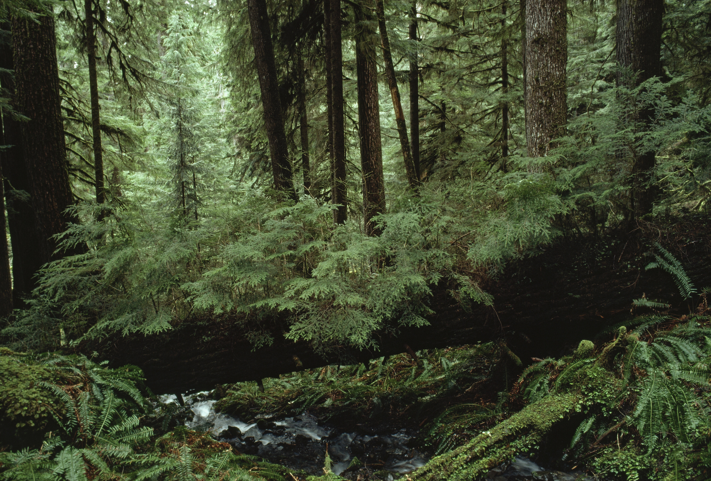

# Portfolio

<!DOCTYPE html>
<html lang="eng">
<head>
    <meta charset="UTF-8">
    <meta name="viewport" content="width=device-width, initial-scale=1.0">
    <link rel="stylesheet" href="Portfolio.css">
    <title>Фотограф Ирма Шевченко</title>
    
    
</head>
<body>
    <header>
       
            <nav>
                <ul>
                    <li><a href="#home">Home</a></li>
                    <li><a href="#portfolio">Portfolio</a></li>
                    <li><a href="#about">About me</a></li>
                    <li><a href="#contact">Contacts</a></li>
                </ul>
            </nav>
        
    </header>

    
    <main>

        <section id="home">

            
                <h1 class="home-title">Welcome to Irma Shevchenko's website</h1>
                
Professional photographer

               
           
            
        </section>
    
        <section id="portfolio">
    
            

                <h2>Portfolio</h2>
            
                

                   

                    

                        
                    

            
                    

                        
                    

            
                    

                        
                    

            
                    

                        
                    

            
                    

                        
                    

            
                    

                        
                    

                   

            
                   
        
                

            
 
    
            
        </section>
      
        <section id="about">
            <h1 class="about-text">About me</h1>
            

                
                
                    
                          
                

                    

                        
Hello, I'm Irma Shevchenko - a photographer inspired by the world of images and the beauty of every moment. My goal is to capture life's unique moments and convey them in my photographs.

        
                        <h2>My history</h2>
                        
I started my journey in the world of photography many years ago and since then I have delved into this art with passionate inspiration. My work has taken me to different places and events where I have been able to see and capture incredible moments.

               
                        <h2>My mission</h2>
                        
                        
My mission as a photographer is to give you unforgettable photographs that will preserve your important moments and emotions for many years to come. I specialize in portrait and wedding photography and also enjoy working on other projects and ideas.

               
                    

            

        
        </section>
    
        
    
        <section id="contact">
            <h2>Contact me</h2>
            
You can contact me to discuss a shoot, book a session, or just chat about photography. I am always open to new projects and look forward to collaboration.

              
            <form>
                <label for="name">Name:</label>
                <input type="text" id="name" name="name" required>
        
                <label for="email">Email:</label>
                <input type="email" id="email" name="email" required>
        
                <label for="message">Message:</label>
                <textarea id="message" name="message" rows="4" required></textarea>
        
                <button type="submit">Send</button>
            </form>
            
           
        </section>

    </main>

    <footer>
        
        

            <nav>
                <ul>
                    <li><a href="#home">Home</a></li>
                    <li><a href="#portfolio">Portfolio</a></li>
                    <li><a href="#about">About me</a></li>
                    <li><a href="#contact">Contact</a></li>
                </ul>
            </nav>
        

        
        
&copy; 2023 Irma Shevchenko

    </footer>

    
</body>
</html>

body{
    margin: 0px;
    padding: 0px;
    width: 100%;
    height: 100px;
}

/* Шапка (Header) */
header {
    background-color: #000000;
    width: 100%;
    padding: 25px 0;
    text-align: center;
    position: sticky;
    
}

header nav {
    display: flex;
    justify-content: center;
}

header a {
    color: #f1f1f1;
    text-decoration: none;
    margin: 0 15px;
    font-size: 20px;
}

nav ul li a:hover {
    color: rgb(107, 81, 81); 
    
}

 
 
/* Главная (Home) */
#home {
    background-image: url('Fon.jpg');
    background-size: cover;
    background-repeat: no-repeat;
    background-position: center;
    color: #030303;
    text-align: center;
    padding: 100px ;
    min-height:100vh;
    

}

#home img {
    
    height: auto;
    display: block;
    margin: 0 auto;
}

#home h1{
    font-size: 35px;
    margin-top: 250px;
}

#home p {
    font-size: 25px;
   
}

#about h1{
    text-align: center;
}

.home-container{
    max-width: 1200px;
}
    

/* Портфолио (Portfolio) */
#portfolio {
    background-color: #050505;
    padding: 40px 0;
    height: 105vh;
    width: 100%;
    
    
}

#portfolio h2{
    color: #f3dcdc;
    font-size: 25px;
    text-align: center;
}

/* О нас (About) */
#about {
    background-color: #ffffff;
    padding: 40px 0;
    height: 105%;

}

.about-text{
    text-align: center;
}

.container-about {
    display: flex;
    align-items: center;
    min-width: 700px;
}

.info_content {
    flex: 1;
    padding-left: 20px; /* Регулируйте отступ по вашему усмотрению */
    font-size: 18px;
    margin-right: 15px;
    margin-left: 15px;
}

img{
    width: 30%;
    margin-left: 14px;
    border-radius : 13px;
    
}

/* Контакты (Contact) */
#contact {
    
    padding: 40px 0;
}

 
#contant h2{
    text-align: center;
}

/* Футер (Footer) */

footer p {
    margin-top: 10px;
    font-size: 14px;
    color: #ffffff; /* Цвет текста */
}

footer p a {
    color: #ffffff; /* Цвет ссылки */
    text-decoration: none;
}

footer p a:hover {
    text-decoration: underline; /* Подчеркивание при наведении */
}

footer {
    background-color: #000000;
    padding: 20px 0;
    text-align: center;
}

footer a {
    color: #ffffff;
    text-decoration: none;
    margin: 0 15px;
    font-size: 20px;
}

.footer p>&copy {
    color: #fff;
}
  
.container .img-container {
  display: flex;
  justify-content: center;
  flex-wrap: wrap;
  gap: 15px;
}

.container .img-container .img {
  width: 350px;
  height: 250px;
  border: 10px solid #fff;
  overflow: hidden;
  cursor: pointer;
}

.container .img-container .img img {
  width: 100%;
  height: 100%;
  object-fit: cover;
  transition: .5s;
}

.container .img-container .img:hover img {
  transform: scale(1.1);
}

.container .pop-up {
  position: fixed;
  top: 0;
  left: 0;
  height: 100%;
  width: 100%;
  background: rgba(0,0,0,.8);
  z-index: 1;
  display: none;
}

.container .pop-up span {
  position: fixed;
  top: 10px;
  right: 20px;
  font-size: 50px;
  font-weight: 900;
  width: 40px;
  height: 40px;
  background: #fff;
  border-radius: 50%;
  text-align: center;
  line-height: 40px;
  cursor: pointer;
}

.container .pop-up img {
  position: absolute;
  top: 50%;
  left: 50%;
  transform: translate(-50%, -50%);
  border: 5px solid #fff;
  border-radius: 8px;
  width: 700px;
}

#contact {
    background-color: #787777; 
    padding: 40px 0;
    text-align: center;
    height: 75vh; /* Высота изменена для примера, можете настроить по вашему усмотрению */
}

#contact h2 {
    color: #000000;
    font-size: 25px;
}

/* Форма стилей */
section form {
    display: flex;
    flex-direction: column;
    align-items: center;
    background-color: rgba(255, 255, 255, 0.8); /* Прозрачный белый фон */
    border-radius: 15px; /* Радиус скругления краев */
    padding: 20px;
    padding-top: 14px;
    margin-bottom: 17px;
    box-shadow: 0 0 10px rgba(0, 0, 0, 0.1);
    width: 300px; /* Измените размер по необходимости */
    margin: 0 auto;
}

section form label {
    color: #0a0a0a;
    margin-bottom: 5px;
}

section form input, section form textarea {
    padding: 8px;
    margin-bottom: 16px;
    border: 2spx solid #1d1c1c;
    border-radius: 5px;
    box-sizing: border-box;
}

section form button {
    padding: 10px;
    background-color: #4caf50;
    color: #252525;
    border: none;
    border-radius: 5px;
    cursor: pointer;
}

section form button:hover {
    background-color: #45a049;
}

